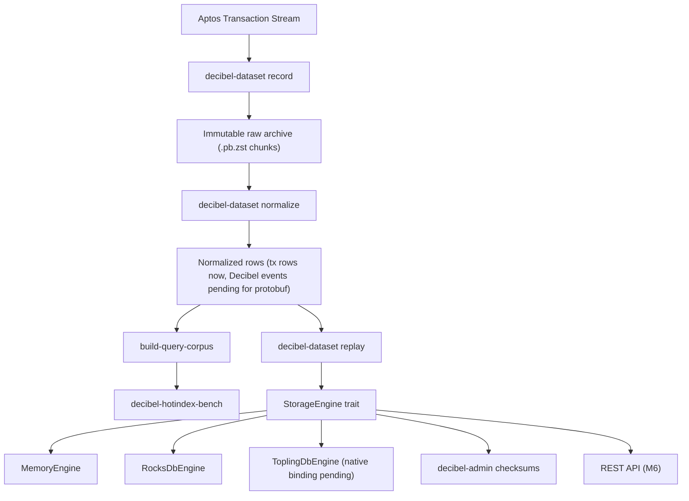

# Architecture

Decibel HotIndex is organized around an offline, reproducible dataset pipeline.

```text
Aptos mainnet Transaction Stream
  -> decibel-dataset record
  -> immutable raw archive (.pb.zst chunks)
  -> decibel-dataset normalize
  -> normalized Decibel rows (.ndjson.zst initially)
  -> decibel-dataset build-query-corpus
  -> decibel-dataset replay
  -> StorageEngine
       |-- MemoryEngine
       |-- RocksDbEngine
       `-- ToplingDbEngine
  -> REST API / benchmark runner / dashboard
```



## Boundaries

- `decibel-dataset` owns online recording, local normalization, query corpus generation, and replay.
- `decibel-hotindex-storage` owns backend-neutral storage APIs and key encoding.
- `decibel-admin` owns checksum and cross-backend equivalence checks.
- `decibel-hotindex-bench` consumes only local datasets and materialized DBs.
- `decibel-hotindex-api` serves already indexed data.

## Mainnet Data Policy

Real benchmark data is mainnet-first. The raw archive is immutable and should be pulled once per bounded version range. RocksDB and ToplingDB must both be materialized from the same saved dataset.

## Safety Policy

The system does not sign transactions, manage private keys, custody funds, or execute trading strategies.
